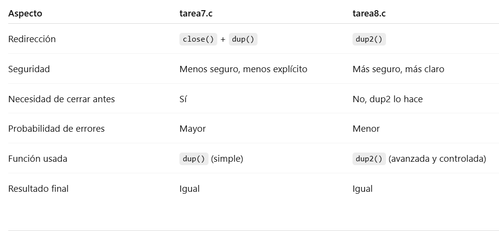

Tarea 7 usa close() + dup():

HIJO:
close(STDOUT_FILENO); // cerrar stdout
dup(fd[1]);           // copiar fd[1] en el primer descriptor libre (será stdout)

PADRE:
close(STDIN_FILENO);
dup(fd[0]);

Tarea 8 usa dup2()->cierra la salida estándar y reedirige al mismo tiempo. Evita condiciones de carrera:

HIJO:
dup2(fd[1], STDOUT_FILENO);

PADRE:
dup2(fd[0], STDIN_FILENO);

